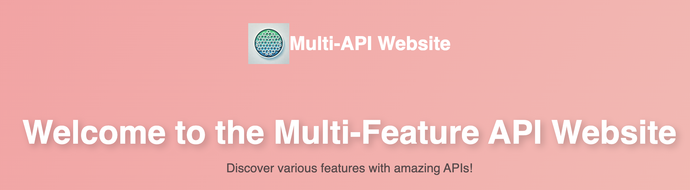

# Multi-API Website 

## Description
This is a Multi API Website I made using Flask Python and Html & Css. You could find some of the most popular APIs in my website such as the weather API and news API.
## What's included
- Openweather API:
  It is a weather API that allows you to check the weather or the specific city you want to know.
- Cat Facts API:
  This is an API that generates random cat facts, don't mind me I'm a cat person!
- Github Profile Viewer:
  This is a Github API that allows users to search a Github user's repo alongside with the stars and forks by inputting the username of the user.
- Quote of the Day:
  It is a quote API that generates a new quote every single day.
- Joke Generator:
  It is an API that generates jokes. You can customize the theme of the joke that it generates.
- Currency Exchange Rate:
  It is a currency exchange API that allows you to find the exchange rate, and I've also included popular exchange rates with a list of currency codes from different countries. 
## License
I don't know much about this but I found it in the choosealicense.com so I was like sure. 

MIT License

Copyright (c) [2025] [Andy Li]

Permission is hereby granted, free of charge, to any person obtaining a copy
of this software and associated documentation files (the "Software"), to deal
in the Software without restriction, including without limitation the rights
to use, copy, modify, merge, publish, distribute, sublicense, and/or sell
copies of the Software, and to permit persons to whom the Software is
furnished to do so, subject to the following conditions:

The above copyright notice and this permission notice shall be included in all
copies or substantial portions of the Software.

THE SOFTWARE IS PROVIDED "AS IS", WITHOUT WARRANTY OF ANY KIND, EXPRESS OR
IMPLIED, INCLUDING BUT NOT LIMITED TO THE WARRANTIES OF MERCHANTABILITY,
FITNESS FOR A PARTICULAR PURPOSE AND NONINFRINGEMENT. IN NO EVENT SHALL THE
AUTHORS OR COPYRIGHT HOLDERS BE LIABLE FOR ANY CLAIM, DAMAGES OR OTHER
LIABILITY, WHETHER IN AN ACTION OF CONTRACT, TORT OR OTHERWISE, ARISING FROM,
OUT OF OR IN CONNECTION WITH THE SOFTWARE OR THE USE OR OTHER DEALINGS IN THE
SOFTWARE.
